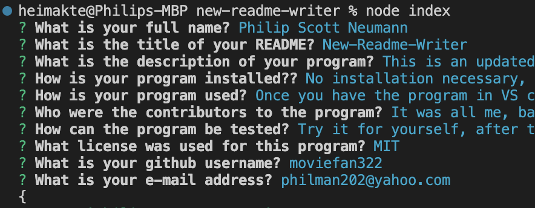

# New-Readme-Writer 

## Table of Contents

### [Description](#description)

### [Installation](#installation)

### [Usage](#usage)

### [Screenshot](#screenshot)

### [Testing](#testing)

### [Contributors](#contributors)

### [License](#license)

### [Questions](#questions)

## Description 

This is an updated README writer, it will ask a series of questions and output a nice readme!

## Installation 

No installation necessary, simply copy the github repo and open in VS code!

## Usage 

Once you have the program in VS code, run an 'npm i' and the 'node index' in your CLI!

## Screenshot 

//INSERT LINK TO SCREENSHOT BELOW!

## Testing 

Try it for yourself, after the prompts you will have a great README

## Contributors 

It was all me, baby!

## License 

This is an updated README writer, it will ask a series of questions and output a nice readme!

## Questions 

Philip Scott Neumann

https://github.com/moviefan322

philman202@yahoo.com
